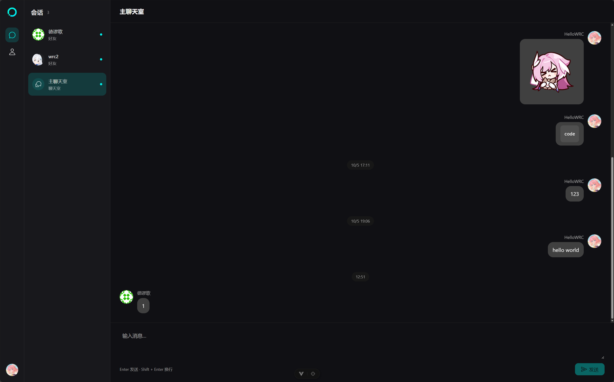

# CiRCLE Chat

> [!caution]
> 这个项目是我的一个 Spring 学习项目，远没有达到作为生产环境的聊天室应用的标准，请不要在生产环境使用此项目。



CiRCLE Chat 是一个基于 Spring Boot + Vue.js 的轻量级聊天室，支持使用 Markdown 语法进行全员群聊和成员单聊，并可以持久在云端保持聊天记录。

## 功能

- 用户注册与登录
- 多人聊天
- 与他人添加好友并进行单聊
- 实时接收当前会话的聊天信息
- 聊天记录持久化保存
- 在聊天中使用 Markdown
- 自动根据电子邮件从 Gravatar 获取头像
- ……

## 已知缺陷

由于开发时间紧张，这个项目还有很多不完善的地方。

- **不支持验证用户的电子邮件：** 用户可以使用任意电子邮件注册，不会验证其是否真正拥有此邮件的所有权
- **不支持用户自行创建群聊：** 虽然应用已经有群聊模式的会话支持，但尚未完善用户自行创建和管理群聊的功能
- **不具备管理功能：** 尽管用户模型内部已有管理员/用户的角色区分，但管理员目前没有实际的系统管理功能。同理，群聊管理员也没有实际管理群聊的能力。
- **没有完善的数据库迁移机制：** 目前应用依赖 JPA 的自动迁移机制在更新实体模型后进行迁移，尽管可以满足开发需求，但达不到生产级的数据库迁移实现标准。
- **不具备完善的消息操作功能：** 目前还不支持用户撤回、引用、转发等聊天工具基础的消息操作
- 未进行移动端适配
- 不支持在会话外显示已读/未读状态
- 不支持实时接收其它会话和新好友申请的消息
- 消息不支持在页面关闭后通过浏览器推送给用户
- ……

## 快速开始

首先确保你的环境满足以下条件：

- 已安装 [Docker Engine](https://docs.docker.com/engine/)
- 网络环境可正常访问 [docker.io](https://docker.io)（或已正确配置间接访问其的镜像）

拉取本仓库，然后进入仓库目录启动 Docker Compose 集群，即可启动应用。数据库等要素已自动完成配置。

```bash
git clone https://github.com/HelloWRC/CircleChat
cd CircleChat
docker compose up -d --build
```

应用默认会监听 `http://localhost:8080`，你可以使用 nginx 或其它你喜欢的反代工具将其反代到公网上。

应用启动后会创建一个默认的超级管理员账户。**请在部署后立即登录并修改密码。**

| 用户名 | 密码 |
| --- | --- |
| `root` | `believe_the_rainbow` |

恭喜！你已成功在你的服务器上部署了 CiRCLE Chat！

## 配置

默认配置即可启动。需要调整时，可将 `.env.example` 复制为根目录 `.env` 后编辑，或设置同名环境变量。修改后再次执行 `docker compose up -d --build`。

| 配置 | 默认值 | 用途 |
| --- | --- | --- |
| `POSTGRES_DB` | `circlechat` | Compose 内置数据库名称 |
| `POSTGRES_USER` | `circlechat` | Compose 内置数据库用户 |
| `POSTGRES_PASSWORD` | `circlechat` | Compose 内置数据库密码，上线时请设置自定义密码 |
| `CIRCLECHAT_PORT` | `8080` | 宿主机应用端口，仅绑定 `127.0.0.1` |
| `CIRCLECHAT_STOP_GRACE_PERIOD` | `60s` | 应用容器停止宽限期 |
| `CHAT_PERSISTENCE_CAPACITY` | `10000` | 待写消息容量，包含排队、写入和重试中的消息 |
| `CHAT_PERSISTENCE_SHUTDOWN_MILLIS` | `30000` | 停机时等待消息排空的时间，毫秒 |
| `CHAT_PERSISTENCE_RETRY_MILLIS` | `1000` | 写库首次重试间隔，毫秒 |
| `CHAT_PERSISTENCE_MAX_RETRY_MILLIS` | `30000` | 写库最大重试间隔，毫秒 |

## 开发

要开发本应用，你需要安装以下依赖：

- JDK 25
- Node.js 24
- pnpm 11.7.0
- PostgreSQL 18
- Git

1. 克隆并进入代码库。

    ``` bash
    git clone https://github.com/HelloWRC/CircleChat
    cd CircleChat
    ```

2. 配置数据库。
    
    在你的 PostgreSQL 中新建一个名为 `circle` 的数据库，并为你接下来要使用的用户分配读写这个数据库的权限。将 `.env.example` 复制到 `.env`，然后将其中的数据库配置替换为你的真实配置。例如：

    ```bash
    SPRING_DATASOURCE_URL=jdbc:postgresql://localhost:5432/circle
    SPRING_DATASOURCE_USERNAME=你的数据库用户名
    SPRING_DATASOURCE_PASSWORD=你的数据库密码
    ```

3. 安装前端依赖
    
    进入前端源代码目录 `/src/client`，然后使用 `pnpm` 安装依赖。

    ```bash
    cd src/client
    pnpm install --frozen-lockfile
    ```
   
4. 启动应用
    
    打开两个终端，分别用于启动后端和前端。

    其中一个终端在项目根目录执行：

    ```bash
    ./gradlew bootRun
    ```
   
    另一个终端在项目根目录执行：

    ```bash
    cd src/client
    pnpm dev --port 5173 --strictPort
    ```

    与生产环境相同，应用也会创建一个默认的超级用户。[详细请见上文](#快速开始)。

5. 发布

    当需要在本地发布 jar 包时，运行以下命令：

    ```bash
    ./gradlew bootJar
    ```
   
    此命令会同时构建后端和前端文件，并将应用运行所需的前端页面一并打包到 Jar 包中，无需使用 pnpm 手动构建。

## 许可

本项目基于 [AGPL-3.0](./LICENSE.txt) 获得许可。
